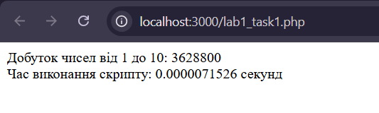
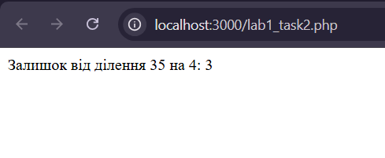

# Лабораторна робота №1

**Тема:** Налаштування середовища PHP розробки
**Виконавець:** Горецький Максим  
**Група:** KNms1-B23  
**Дата виконання:** 06.04.2025  
**Варіант:** 6

---

## Завдання 1

**Умова:**  
Розрахунок часу виконання коду для обчислення добутку чисел від 1 до 10.

[Переглянути код](lab5_task1.php)

**Результат:**

---

## Завдання 2

**Умова:**  
Виведення залишку від ділення числа (35 на 4).

[Переглянути код](lab5_task2.php)

**Результат:**

