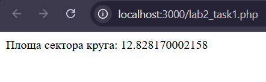
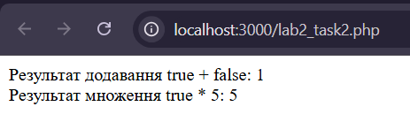

 Лабораторна робота №2

**Тема:** Основи роботи з PHP  
**Виконавець:** Горецький Максим  
**Група:** KNms1-B23  
**Дата виконання:** 06.04.2025  
**Варіант:** 6

---

## Завдання 1

**Умова:**  
Напишіть PHP-скрипт, який обчислює площу сектора круга за формулою:
S = (α * r²) / 2

де α = 30 (градусів), r = 7.

[Переглянути код](lab2_task1.php)

**Результат:**

---

## Завдання 2

**Умова:**  
Напишіть PHP-скрипт, який використовує булеві значення, виконує їх перетворення у числа та обчислення.

[Переглянути код](lab2_task2.php)

**Результат:**

