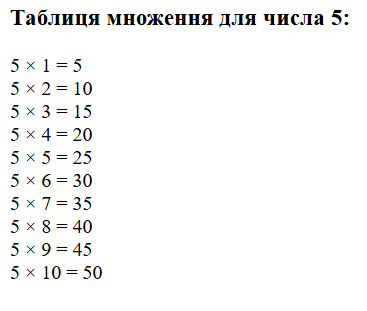
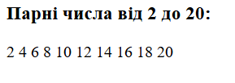

# Лабораторна робота №3

**Тема:** Управління потоками виконання в PHP  
**Виконавець:** Горецький Максим  
**Група:** KNms1-B23  
**Дата виконання:** 06.04.2025  
**Варіант:** 6

---

## Завдання 1

**Умова:**  
Створіть скрипт, який виводить таблицю множення для числа 5 за допомогою циклу `for`.

```php
<?php
echo "<h3>Таблиця множення для числа 5:</h3>";
for ($i = 1; $i <= 10; $i++) {
    echo "5 × $i = " . (5 * $i) . "<br>";
}
?>
```

[Перейти до коду](lab3_task1.php)

**Результат:**



---

## Завдання 2 

**Умова:**  
Створіть скрипт, що виводить всі парні числа від 2 до 20, використовуючи цикл `while`.

```php
<?php
echo "<h3>Парні числа від 2 до 20:</h3>";
$i = 2;
while ($i <= 20) {
    echo "$i ";
    $i += 2;
}
?>
```

[Перейти до коду](lab3_task2.php)

**Результат:**


