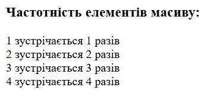
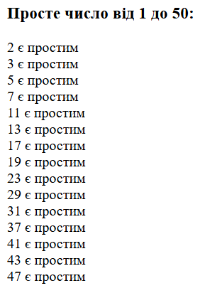

# Лабораторна робота №4

**Тема:** Робота з масивами та функціями в PHP  
**Виконавець:** Горецький Максим  
**Група:** KNms1-B23  
**Дата виконання:** 06.04.2025  
**Варіант:** 6

---

## Завдання 1

**Умова:**  
Напишіть скрипт, який підраховує, скільки разів кожен елемент зустрічається в масиві.

[Переглянути код](lab4_task1.php)

**Результат:**

---

## Завдання 2

**Умова:**  
Створіть функцію `isPrime($number)`, яка перевіряє, чи є число простим. Використайте її для чисел від 1 до 50.

[Переглянути код](lab4_task2.php)

**Результат:**

