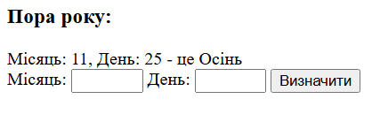
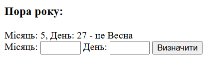
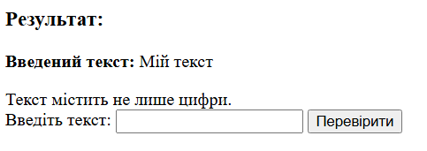
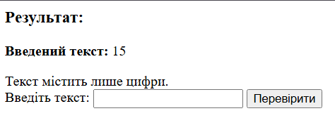

# Лабораторна робота №5

**Тема:** Робота з формами в PHP  
**Виконавець:** Горецький Максим  
**Група:** KNms1-B23  
**Дата виконання:** 06.04.2025  
**Варіант:** 6

---

## Завдання 1

**Умова:**  
Створіть форму для введення місяця та дня. Передайте їх методом GET та визначте пору року.
```
<?php
if (isset($_GET['month']) && isset($_GET['day'])) {
    $month = $_GET['month'];
    $day = $_GET['day'];
    $season = "";

    if (($month == 12 && $day >= 21) || ($month >= 3 && $month <= 5)) {
        $season = "Весна";
    } elseif (($month >= 6 && $month <= 8)) {
        $season = "Літо";
    } elseif (($month >= 9 && $month <= 11) || ($month == 12 && $day < 21)) {
        $season = "Осінь";
    } else {
        $season = "Зима";
    }

    echo "<h3>Пора року:</h3>";
    echo "Місяць: $month, День: $day - це $season";
}
?>

<form action="lab5_task1.php" method="GET">
    <label for="month">Місяць:</label>
    <input type="number" id="month" name="month" min="1" max="12" required>
    <label for="day">День:</label>
    <input type="number" id="day" name="day" min="1" max="31" required>
    <input type="submit" value="Визначити">
</form>
```
[Переглянути код](lab5_task1.php)

**Результат:**



---

## Завдання 2

**Умова:**  
Розробіть форму для введення тексту. Використовуйте метод POST. Перевірте, чи містить текст лише цифри.

[Переглянути код](lab5_task2.php)

**Результат:**



