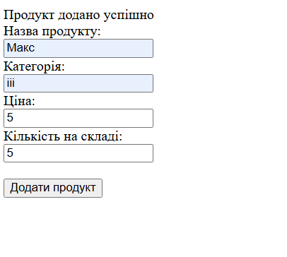
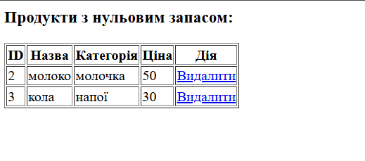

# Лабораторна робота №6

**Тема:** Взаємодія з MySQL. CRUD-операції  
**Виконавець:** Горецький Максим  
**Група:** KNms1-B23  
**Дата виконання:** 15.06.2025  
**Варіант:** 5

---

## Завдання 1

**Умова:**  
Створити базу даних "Products" та таблицю "ProductDetails" зі стовпцями:  
`id`, `name`, `category`, `price`, `stock_quantity`.

[➡️ Перейти до коду](lab6_task1.php)

**Результат:**  

---

## Завдання 2

**Умова:**  
Реалізувати сторінку для створення нового продукту та валідацію введених даних.

[➡️ Перейти до коду](lab6_task2.php)

**Результат:**  

---

## Завдання 3

**Умова:**  
Додати функціонал для відображення та видалення продуктів, які більше не доступні на складі (stock_quantity = 0).

[➡️ Перейти до коду](lab6_task3.php)

**Результат:**  

