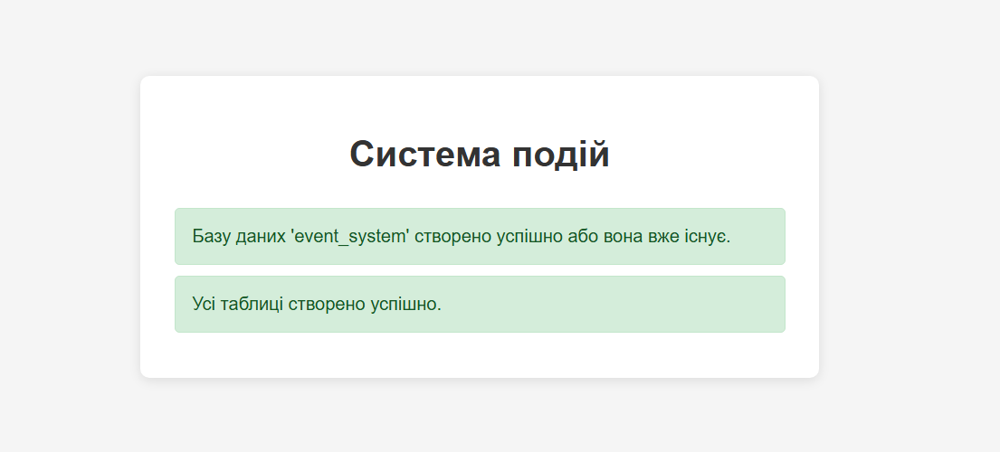
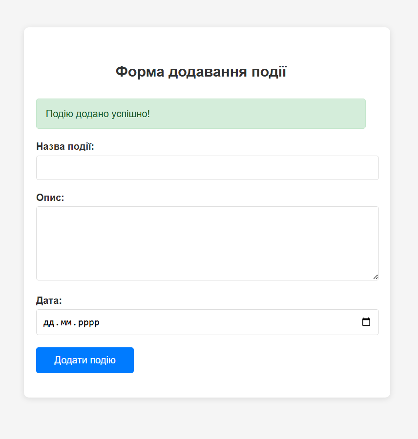
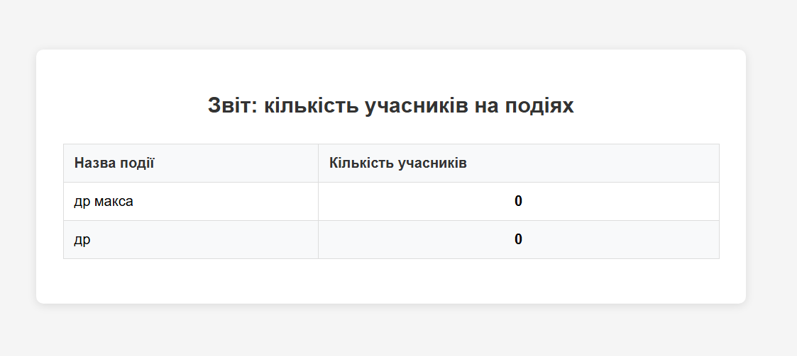

# Лабораторна робота №7

**Тема:** Міні-проєкт з взаємодії з MySQL  
**Виконавець:** Горецький Максим  
**Група:** KNms1-B23  
**Дата виконання:** 19.06.2025  
**Варіант:** 5

---

## Завдання 1

**Умова:**  
Створити базу даних `event_system` та таблиці:

- `events(id, title, description, date)`
- `participants(id, name, email, event_id)`
- `organizers(id, name, contact)`

[➡️ Перейти до коду](lab7_task1.php)

**Результат:**  

---

## Завдання 2

**Умова:**  
Реалізувати сторінку для додавання нової події з формою, валідацією та збереженням у базу.

[➡️ Перейти до коду](lab7_task2.php)

**Результат:**  

---

## Завдання 3

**Умова:**  
Реалізувати звіт, який показує кількість учасників на кожній події.

[➡️ Перейти до коду](lab7_task3.php)

**Результат:**  

